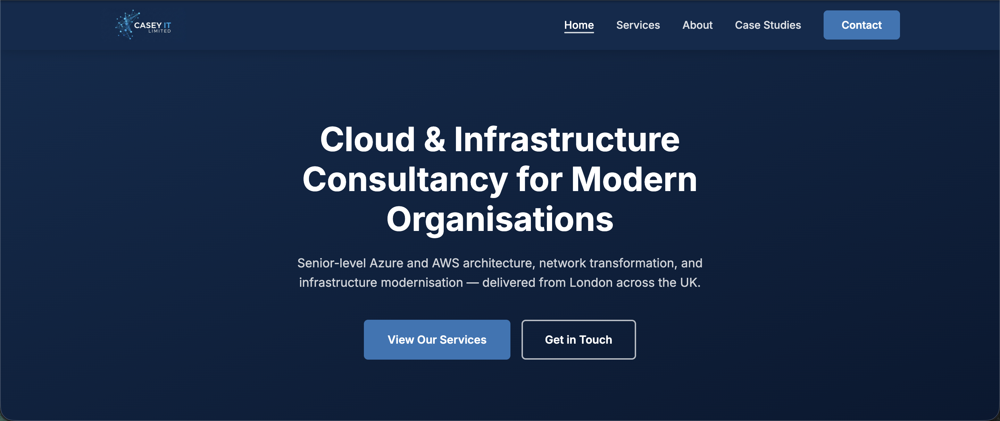

<p align="center">
  
</p>

<h1 align="center">Casey IT Limited — Company Website</h1>

<p align="center">
  London-based IT consultancy specialising in Azure cloud architecture, network modernisation, and infrastructure transformation.
  <br />
  <a href="https://casey-it.co.uk"><strong>Visit the live site →</strong></a>
</p>

---

## Preview

[](https://casey-it.co.uk)

---

## About

Casey IT Limited is a London-based IT consultancy founded in 2019 by Matthew Casey — a Microsoft Certified Azure Solutions Architect Expert and AWS SysOps professional. The company partners with organisations across residential property, social housing, healthcare, and the arts to design, build, and transition modern IT environments.

Every engagement is led personally by Matthew Casey, ensuring continuity, accountability, and genuine senior-level expertise at every stage.

## Services

- **Cloud Migration** — Azure and AWS migration strategy, architecture design, and hands-on delivery
- **Infrastructure Architecture** — Design and remediation of server, storage, and virtualisation estates
- **Network Modernisation** — Multi-site LAN/WAN/WLAN standardisation with Cisco Meraki and SD-WAN
- **Microsoft 365 & Azure AD** — Security hardening, Intune endpoint management, and licensing optimisation
- **Infrastructure as Code** — Terraform-driven deployments for repeatable, auditable cloud environments
- **IT Mobilisation** — Full IT infrastructure delivery for new sites, offices, or residential developments

---

## Tech Stack

| Technology | Purpose |
|---|---|
| HTML5 | Page structure and content |
| CSS3 (custom) | Styling — no framework |
| Vanilla JavaScript | Animations and nav interactions |
| Google Fonts (Inter) | Typography |
| `sitemap.xml` | SEO |

Built deliberately without any JS framework, build tools, or bundler — the result is a fast, lightweight site with zero dependencies.

## Architecture

This is a static multi-page site. Each page is a self-contained `.html` file that shares a single stylesheet and script:

```
├── index.html          # Home
├── about.html          # About Matthew Casey
├── services.html       # Full services detail
├── case-studies.html   # Client case studies
├── portfolio.html      # Portfolio
├── contact.html        # Contact form
├── styles.css          # Shared stylesheet
├── animations.js       # Scroll animations and nav behaviour
├── sitemap.xml         # SEO sitemap
├── docs/               # Internal planning docs (not deployed)
└── assets/             # Images and media
```

No backend. No CMS. No build step.

---

## Deployment

The site is hosted on **GitHub Pages** and deployed automatically from the `main` branch. The custom domain `casey-it.co.uk` is configured via DNS.

## Contact

**Email** — [info@casey-it.co.uk](mailto:info@casey-it.co.uk)
**Website** — [casey-it.co.uk](https://casey-it.co.uk)
**LinkedIn** — [matthew-casey00](https://www.linkedin.com/in/matthew-casey00/)

---

*© 2026 Casey IT Limited. Registered in England and Wales. Company No. 12074186.*
